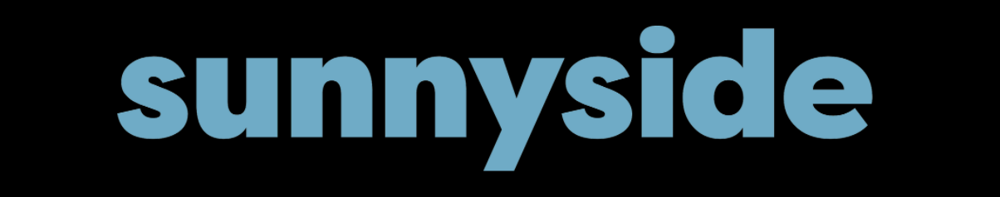
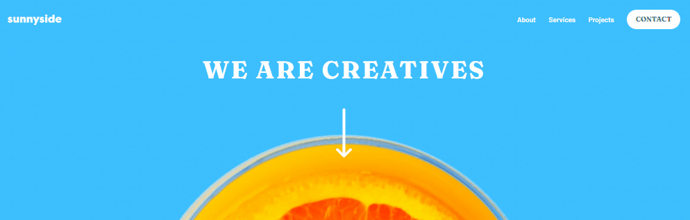

# 

 O projeto Sunnyside foi feito com base na proposta do site Frontend Mentor e consiste na criação de uma landing page responsiva com o tema da agência fictícia Sunnyside, especializada no desenvolvimento de marcas.
 

Na landing page são mostradas informações, técnicas utilizadas pela empresa e testemunhos dos clientes. Abaixo o processo de criação será detalhado.

  <a href="#processo">Processo</a> --
  <a href="#tecnologias">Tecnologias Utilizadas</a> --
  <a href="#aprendizados">Aprendizados</a> --
  <a href="#final">Projeto Final</a> 

<h1 align="center">
  
</h1>

 

# Processo

Imagens da introdução e da section de imagens são modificadas de acordo com o tamanho do display.

A tipografia utilizada para parágrafos foi <strong>"Barlow"</strong> e para títulos <strong>"Fraunces"</strong>. 

Media queries levaram em consideração o momento em que o layout "quebrava" e variou conforme os blocos da página. Dessa forma foi possível deixar o site responsivo.

O site foi construído de acordo com as Landmarks do HTML <strong>header</strong>, <strong>main</strong>, <strong>section</strong> e <strong>articles</strong> e por fim o <strong>footer</strong>. A parte responsiva era feita logo após a finalização do layout para navegadores em desktop, assim como a correção de erros e teste de diferentes tamanhos de display.

O CSS foi dividido em arquivos na pasta <strong>style</strong> com os respectivos nomes dos blocos em que aplicam os estilos. Tanto a tipografia, como as variáveis de cores foram colocadas em arquivos separados para melhor organização.

As otimizações ao final do projeto foram feitas acompanhando a avaliação da ferramenta <strong>Lighthouse</strong> do Google Chrome. O objetivo era obter um site com desempenho estável, que obedecesse boas práticas no código e em acessibilidade.

 
 

# Tecnologias

Tecnologias utilizadas no projeto:

<ul>
  <li>HTML</li>
  <li>CSS</li>
  <li>JavaScript</li>
</ul>

 
 

# Aprendizados

Ao decorrer do desenvolvimento surgiram questões sobre a melhor forma de se posicionar e definir o tamanho máximo de uma imagem dentro da propriedade CSS <strong>"grid"</strong>. Consultando outros desenvolvedores na plataforma <strong>Slack</strong>, pude entender seu funcionamento e a definição de colunas e linhas de forma responsiva.

Outra dificuldade enfrentada foi o vazamento da margem de certos objetos, resolvido com <strong>media queries</strong>, responsáveis pela diminuição de tipografia e alteração do <strong>grid-template-colums</strong> de duas colunas para uma, por exemplo.
 

Na criação do menu para dispositios mobile encontrei uma alternativa que envolvia o bloco do menu em uma div com classe <strong>.active</strong> definida com <strong>display: none</strong>, apenas ativada em determinado tamanho de tela pelo clique do botão, o que me fez estudar mais a linguagem JavaScript.
 

Por fim, também pude aprender como alterar propriedades de imagens em SVG ao utilizarmos o <strong>:hover</strong> no CSS inline, algo que não tinha conhecimento.

Habilidades desenvolvidas:

<ul>
  <li>Melhor entendimento de <strong>display: grid</strong> e <strong>display: flex</strong></li>
  <li>Utilização de <strong>Landmarks</strong></li>
  <li>Pseudo classes e pseudo elementos</li>
  <li>Modificação de SVG inline</li>
  <li>Responsividade do site</li>
  <li>JavaScript</li>
</ul>

 
 

# Final

O projeto está finalizado. Para verificar o resultado final acesse: <a href="https://sunnyside-kohl.vercel.app/" >https://sunnyside-kohl.vercel.app/</a>

